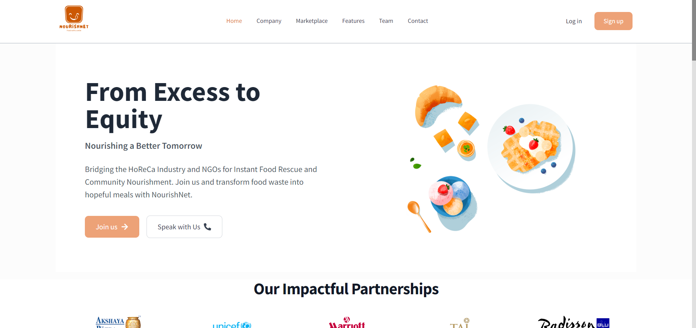

# NourishNet Backend
   
   

# Project Description

The project aims to provide a bridge between the NGOs and the HoReCas (Hotels, Restaurants and Cafes). It is a platform where different hotels can add the food wastage and its quantity and NGOs can collect the food from the hotels to donate it to those in need.

# Features Implemented

## Backend

1. Auth Routes (Both NGO and HoReCa):
   - SignUp
   - Login
   - Authorization (JWT Verification)
2. User Routes:
   - Get user profile
   - Get NGOs
   - Get HoreCas
   - Get user through ID
3. HoReCa Routes:
   - Food Specific:
     - Add Food
     - Update Food
     - Get Food
     - Get All own Food
4. NGO Routes:
     - Get All Food for NGO
     - Get list of available food
     - Update Food delivery process
     - Get my food
     - Select food to be delivered
     - Update status to delivered

 

## Backend

1. Add upload, edit and remove profile picture functionality.
2. Predict hunger zones from the data where the NGO serves the food.

More features to be listed in future.

# Technologies and Packages Used

## Backend

1. Node
2. Express
3. MongoDB
4. Mongoose
5. CORS
6. JWT
7. Bcryptjs
8. Geo-location

# Local Setup

Clone the frontend and backend repositories, cd into them individually, and then follow the below mentioned steps for setting up backend and frontend seprately.

## 1. Backend

1. Fork the repository.
2. Clone the repository (`git clone URL`).
3. Open the folder in which you cloned the repository.
4. Run `npm install`.
5. Create a .env file same as the given env file (.example.env).
6. Create a local MongoDB database using mongo shell or you can use hosted MongoDB database as well using MongoDB Atlas. Once any one of them is setup you can substitute their URI in the .env file.
7. Add a secret value to .env file.
8. Now you can run `npm start` and start working localy.

### Connect with me:

### License

[Read here](https://github.com/pranavz02/NourishNet-Backend/blob/main/LICENSE.md)